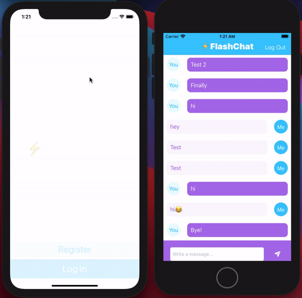

# Flash-Chat

## What I created

Flash Chat is an internet based messaging app similar to WhatsApp. I used a service Firebase Firestore as a backend database to store and retrieve our messages from the cloud. 

## What I Used

* I ntegrate third party libraries in my app using Cocoapods and Swift Package Manager.
* Store data in the cloud using Firebase Firestore.
* Query and sort the Firebase database.
* Use Firebase for user authentication, registration and login.
* Work with UITableViews and set their data sources and delegates.
* Create custom views using .xib files to modify native design components.